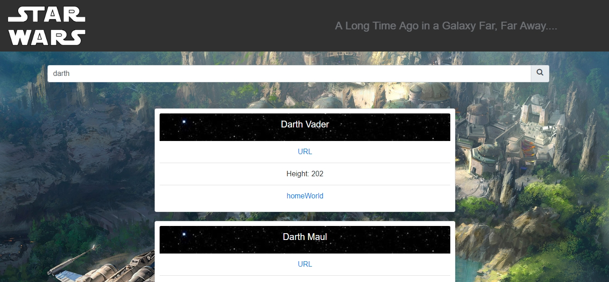
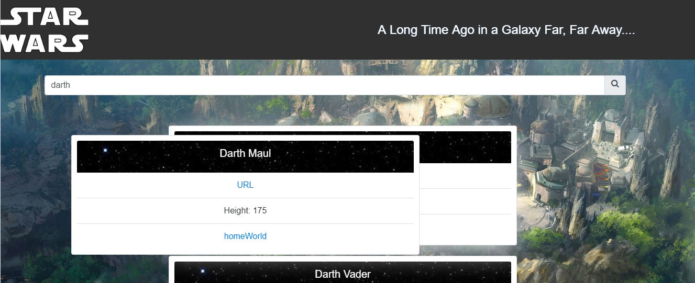
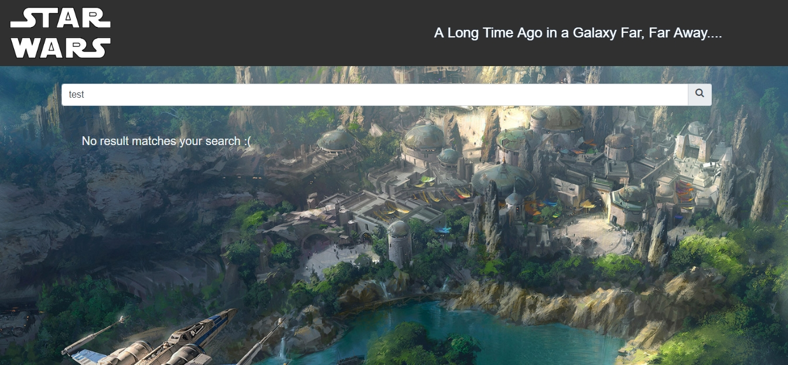

# SW charactrs Task

## Table Of Content

* Overview
* Used Libraries and Framework
* screenShots
* How to Run
* How to Deploy

## Overview

A single page web application made using Angular7, it takes a string in a form input
and search for people using this string input in this public API https://swapi.co. 
The retrieved results then are rendered as cards where each card has the character’s details (Name,
URL, height, homeworld).
Also, the user can drag and drop the rendered cards to reorder them on screen.

### search Approach

To implement the search feature I could use two ways :
1. Use the Api url https://swapi.co/api/people/ which gets a list of **all** people and then make my search query inside this list by filtering it to the elements containing the search term only.
2. Use the Api url https://swapi.co/api/people/?search=r2 which just takes the search term as a parameter in the url, filters the people
and returns a list with **only** the filtered people.

## How To Run

If you want to run the example locally,

* clone this repository
* Run `npm install`
* Run `ng serve` for a dev server. Navigate to `http://localhost:4200/`

## Running unit tests

* Run `npm test` to execute all the tests

## Used tools and Frameworks

* Bootstrap 4
* [Jasmine](https://jasmine.github.io/) 
* FontAwesome for icons
* Angular CDK

## Build

Run `ng build` to build the project. The build artifacts will be stored in the `dist/` directory. 
Use the `--prod` flag for a production build.

## Deploy

for deployment, we need to For create a production build and then copy the output directory (by default dist folder) to the web server.

1. Run the production build command: `ng build --prod`
2. Copy everything within the output folder (dist) to a folder on the server.
3. Configure the server to redirect requests for missing files to index.html.

## Screenshots

